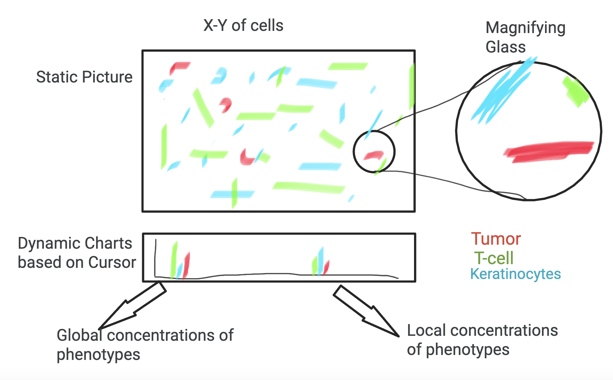
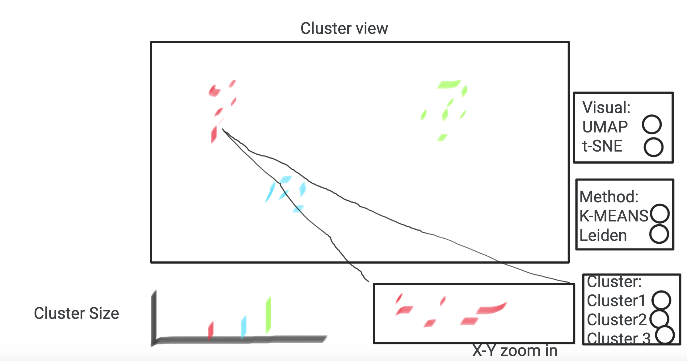

### Project Steps

#### 1. Identify a dataset

We identified a large genomic dataset of a melanoma tissue sample, containing spatially resolved, multiplexed imaging data at a single-cell resolution. The sample contained 1,110,585 individual cells with 17 unique phenotypes. Information on cell nuclei centroids was captured as (X,Y) coordinates; data on 30 antibody markers was also included.

#### 2. Produce sketches

To explore the spatial dimensions of the dataset, we wanted to produce an (X,Y) grid of cells with their phenotypes encoded as colors.

Antibody marker data can be dimensionally reduced using techniques such as TSNE and UMAP to visualize high-level trends. 

#### 3. Streamlit implementation

Computational challenges and concerns of over-stimulating the audience led us to truncate our dataset to a random sample of 10,000 cells. Furthermore, the original 17 phenotype labels were reduced to 13 by grouping *T cells*, *Terminally Exhausted T cells*, *Partially Exhausted T cells*, *Regulatory T cells*, and *Cytotoxic T cells* under one single *T cells* category. 

#### 4. Future work

Inter-phenotype cell interactions are a key source of cancer biologists' interests. A natural extension of this visualization would be a feature that allows for selection of multiple phenotypes for vieiwing in the (X,Y) coordinate scatterplot.